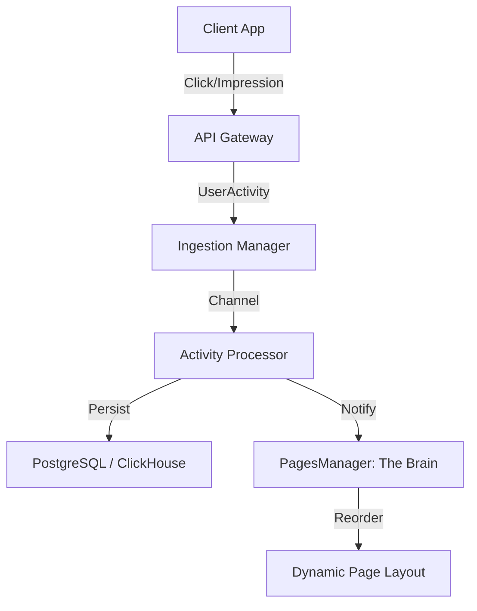

# 📥 Ingestion: The Feedback Brain

> **High-throughput activity collection and real-time feedback orchestration.**

The Ingestion module is the primary sensory organ of Bongas-AI. It collects user interactions (clicks, playbacks, reactions) from various sources and feeds them back into the engine to drive layout optimization and cache invalidation.

[🏠 Hub](../../docs/HUB.md) | [🏗️ Architecture](../../docs/architecture/SYMPHONY.md) | [🧠 The Brain](../../docs/architecture/PAGES.md)

---

## 🏗️ The Feedback Loop

Ingestion is no longer a one-way street. It actively notifies the **PagesManager** of engagement events to enable **Algorithmic Row Ranking**.

## 🧩 Key Components

- **`ActivityProcessor`**: Consumes the ingestion channel, flushes batches to the database, and triggers the layout reordering loop.
- **`InteractionRepository`**: Persists enriched interaction data, including `visitor_id` and `device_hash` for cross-device identity stitching.
- **`Sources`**: Multi-transport support for Kafka (high-scale), API (real-time), and ClickHouse (backfill).

---

[🏠 Hub](../../docs/HUB.md) | [🔝 Top](#-ingestion-the-feedback-brain)
