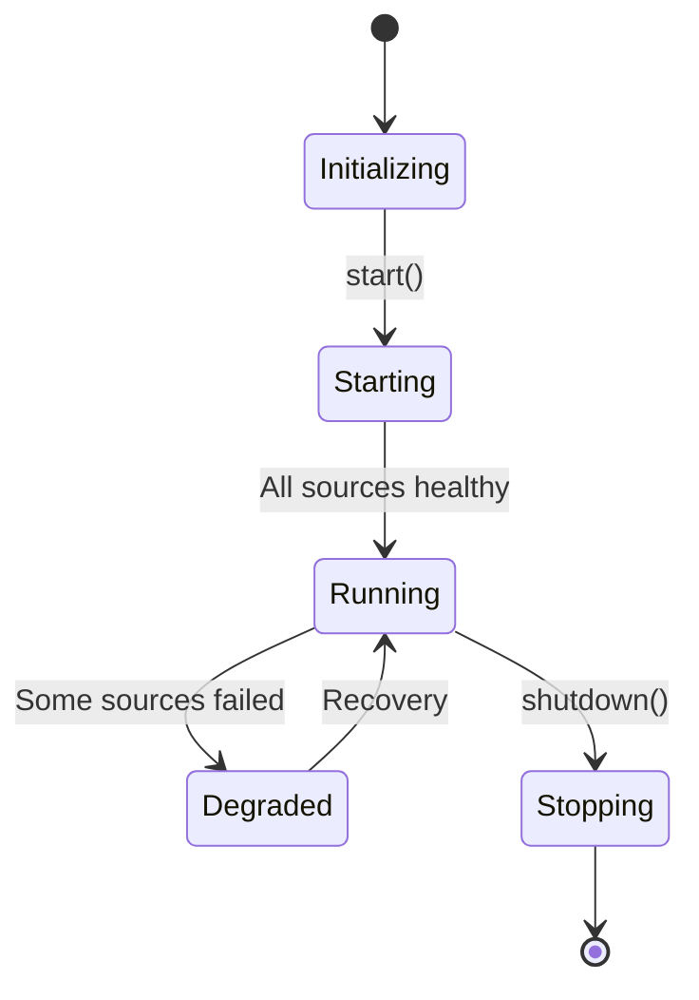

# 🏢 Ingestion: Manager

The central coordinator responsible for starting, monitoring, and shutting down all ingestion components. It ensures that data flows smoothly from sources to the processor.

---

## 🛠️ Management Lifecycle

---

[🏠 Hub](../../../../docs/HUB.md) | [⬅️ Back to Broadcast Main](../README.md)
