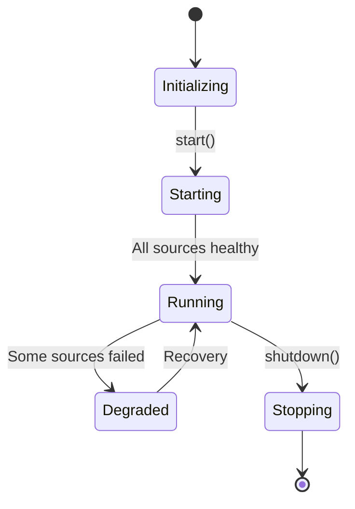

# 🏢 Ingestion: Manager

The central coordinator responsible for starting, monitoring, and shutting down all ingestion components. It ensures that data flows smoothly from sources to the processor.

---

## 🛠️ Management Lifecycle



---

## 🏗️ Netflix-Grade Bootstrapping

To manage the high complexity of the ingestion layer, we use the `IngestionComponents` pattern. This consolidates all 8+ required dependencies into a single, typesafe configuration object, preventing "constructor bloat" and ensuring clean architectural separation.

```rust
let manager = IngestionManager::bootstrap(IngestionComponents {
    pool,
    intelligence,
    cache_manager,
    breaker_registry,
    resilience_metrics,
    staleness_engine,
    pages_manager,
    kafka_config,
}).await?;
```

---

[🏠 Hub](../../../../docs/HUB.md) | [⬅️ Back to Broadcast Main](../README.md)
