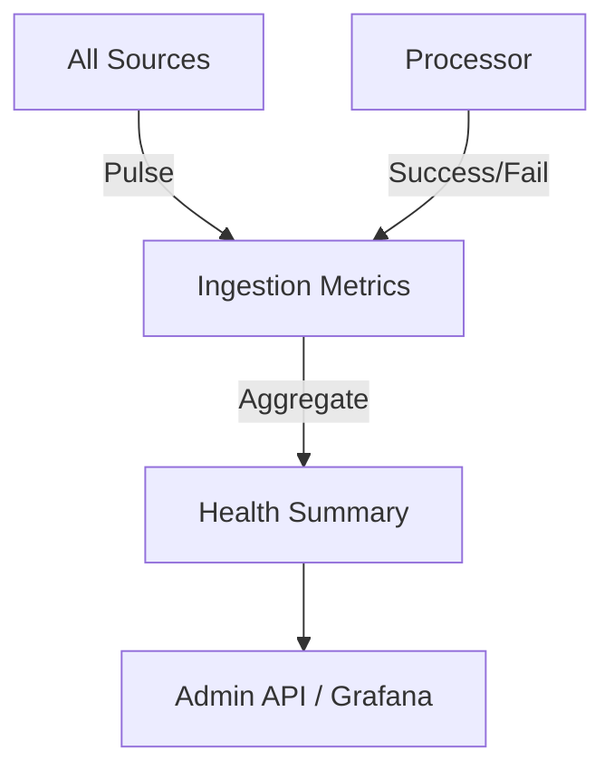

# 📊 Ingestion: Metrics

Monitors the health and performance of all ingestion sources and the processor. Provides aggregated throughput stats and source-level status reporting.

---

## 🏗️ Monitoring Model

---

[🏠 Hub](../../../../docs/HUB.md) | [⬅️ Back to Broadcast Main](../README.md)
