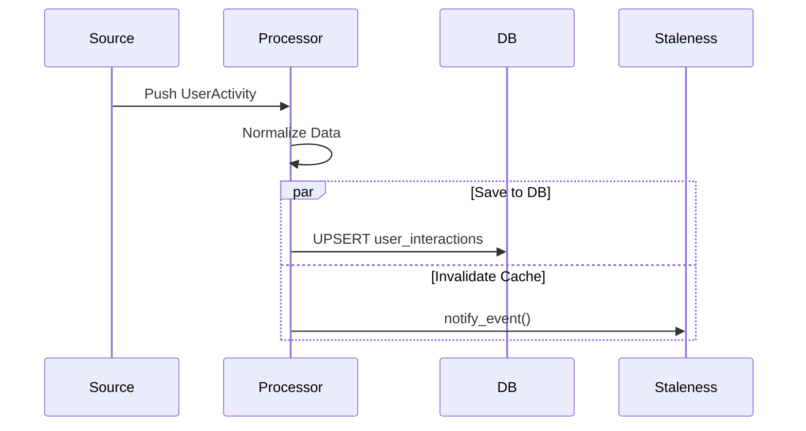

# ⚙️ Ingestion: Processor

The worker component that consumes raw `UserActivity` events from the internal channel. It performs normalization, database persistence, and triggers downstream cache invalidation via the Staleness Engine.

---

## 🛠️ Processing Flow

---
[⬅️ Back to Ingestion Main](../README.md)
