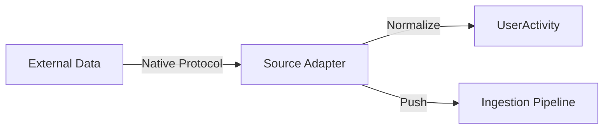

# 📡 Ingestion: Sources

> **Source-specific adapters for user activity streams.**

This module contains pluggable adapters for different data input streams. Each adapter is responsible for connecting to its specific data source, normalizing raw events into the unified `UserActivity` model, and pushing them into the ingestion pipeline.

---

## 🧩 Sub-Modules

| Module | Description |
| :--- | :--- |
| [**⚡ API**](./api/README.md) | Direct HTTP endpoint for real-time user-reaction calls. |
| [**🛠️ ClickHouse**](./clickhouse/README.md) | Polling-based source for OLAP data synchronization. |
| [**🏗️ Kafka**](./kafka/README.md) | High-throughput distributed stream consumer. |

---

## 🏗️ Adapter Interface

---
[⬅️ Back to Ingestion Main](../README.md)
