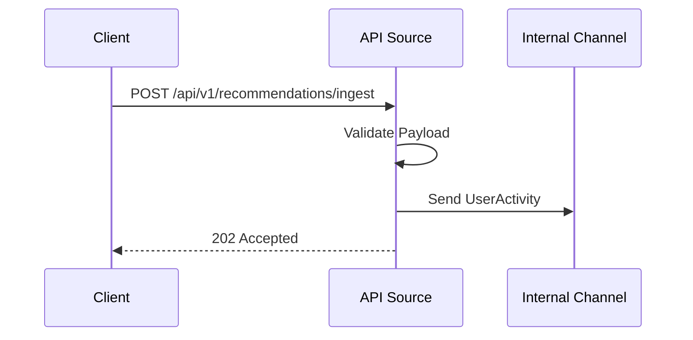

# ⚡ Ingestion Source: API

Provides a direct endpoint for the application or front-end clients to push user activities (like clicks, impressions, or conversions) directly into the recommendation engine.

---

## 🛠️ Data Flow

---

[🏠 Hub](../../../../docs/HUB.md) | [⬅️ Back to Recovery Main](../README.md)
