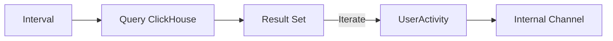

# 🛠️ Ingestion Source: ClickHouse

A polling-based source that periodically queries ClickHouse tables to synchronize historical or batch-processed interactions. Useful for integrating with existing OLAP data pipelines.

---

## 🏗️ Polling Cycle

---

[🏠 Hub](../../../../docs/HUB.md) | [⬅️ Back to Recovery Main](../README.md)
