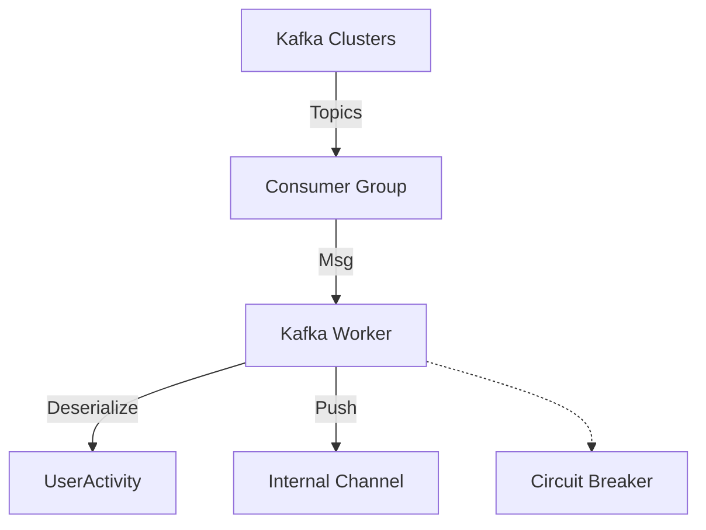

# 🏗️ Ingestion Source: Kafka

The primary high-volume ingestion path. It consumes user interaction events from distributed Kafka topics, providing the scale needed for massive recommendation workloads.

---

## 🏗️ Consumer Architecture

---

[🏠 Hub](../../../../docs/HUB.md) | [⬅️ Back to Recovery Main](../README.md)
