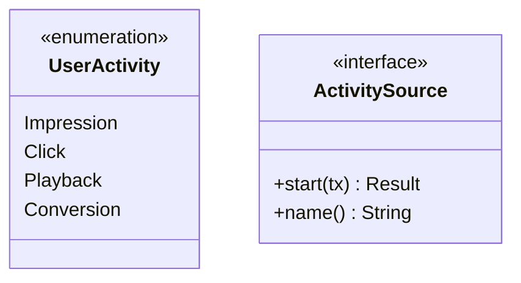

# 🧬 Ingestion: Types

Defines the core `UserActivity` domain model and the `ActivitySource` trait. This ensures a strictly typed contract between various input streams and the central processor.

---

## 🏗️ Domain Model

---

[🏠 Hub](../../../docs/HUB.md) | [⬅️ Back to Ingestion Main](../README.md)
