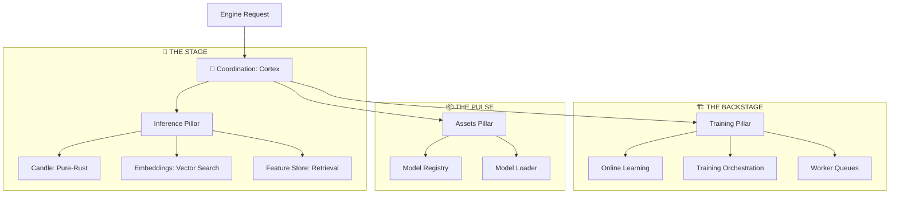

# 🧬 The Cortex: Intelligence Layer

The Cortex module is the machine learning backbone of BONGAS-AI. It follows an audience-based functional pillar architecture, strictly separating real-time inference from heavy training workloads and asset management.

---

## 🏗️ Architecture Overview

The Cortex is organized into three primary pillars, orchestrated by **The Conductor**.

---

## 🏛️ Functional Pillars

### [🎯 THE STAGE (Inference)](./inference/README.md)

The latency-sensitive fast path for real-time model execution and feature retrieval.

- **Candle**: Pure-Rust inference engine with native performance.
- **Embeddings**: High-performance vector resolution and lookups.
- **Features**: Low-latency feature store fetching.

### [🏗️ THE BACKSTAGE (Training)](./training/README.md)

The heavy-lifting domain for model refinement, feedback loops, and compute-intensive tasks.

- **Online Learning**: Incremental model updates from real-time feedback.
- **Orchestration**: Management of training and export pipelines.
- **Workers**: Asynchronous heavy-compute worker orchestration.

### [📦 THE PULSE (Assets)](./assets/README.md)

The ML infrastructure layer managing model lifecycles, health, and swapping.

- **Registry**: Versioned model storage and deployment governance.
- **Loader**: Hot-swapping logic and memory management.
- **Utils**: Shared mathematical and data utilities.

### [🎼 THE CONDUCTOR (Coordination)](./coordination/README.md)

The assembly point that wires the three pillars into a unified `DiscoveryCortex`.

---

[🏠 Hub](../../docs/HUB.md) | [🏠 Back to Project Root](../README.md)
