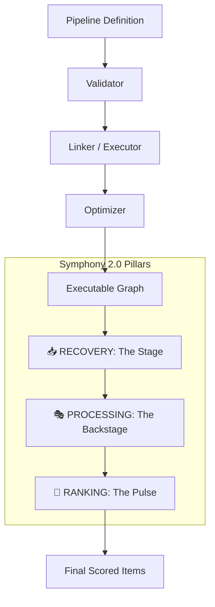

# 🏗️ Pipeline: The Symphony Engine

> **High-performance, pluggable execution engine for complex retrieval, processing, and ranking.**

The Pipeline module is the core execution engine of BONGAS-AI. It enables the definition of sophisticated, multi-pillar recommendation workflows using a pluggable "Symphony" architecture. It supports dynamic branching, parallel execution, and automated JIT-lite optimization.

[🏠 Hub](../../docs/HUB.md) | [🏗️ Architecture](../../docs/architecture/SYMPHONY.md)

---

## 🏗️ Architecture Overview

The pipeline operates as a directed acyclic graph (DAG) of stages, organized into three functional pillars:



---

## 🏛️ Pillar Domains

The engine is strictly organized into three functional domains, ensuring high observability and specialized performance:

| Pillar | Audience | Functional Role |
| :--- | :--- | :--- |
| [**📥 RECOVERY**](./recovery/README.md) | **The Stage** | Candidate retrieval from high-performance data sources (ClickHouse, Redis). |
| [**🎭 PROCESSING**](./processing/README.md) | **The Backstage** | Constraint enforcement, metadata hydration, and deduplication. |
| [**🥇 RANKING**](./ranking/README.md) | **The Pulse** | Intelligence layer using ML (ONNX) and sophisticated re-ranking algorithms. |

---

## 🧩 Infrastructure Modules

| Module | Description |
| :--- | :--- |
| [**⚡ Executor**](./executor/README.md) | High-performance graph traversal and resilient stage execution. |
| [**🌲 Optimizer**](./optimizer/README.md) | JIT-lite fusion and parallelization optimizations. |
| [**🛡️ Validator**](./validator/README.md) | Structural integrity and type-safety gatekeeper. |
| [**🗃️ Registry**](./registry/README.md) | Central manifest of all available pipeline pillars and stages. |
| [**📦 Types**](./types/README.md) | Core traits, domain models, and Netflix-grade error definitions. |

---

## 🚀 Orchestration Example

```rust
// 1. Initialize the Symphony Executor
let executor = PipelineExecutor::new(config, breaker_registry, observer, analytics);

// 2. Link and Execute a dynamic pipeline definition
let linked = executor.link(&definition)?;
let results = executor.execute_linked(&linked, &context).await?;
```

---

[🏠 Hub](../../docs/HUB.md) | [🔝 Top](#️-pipeline-the-symphony-engine)
