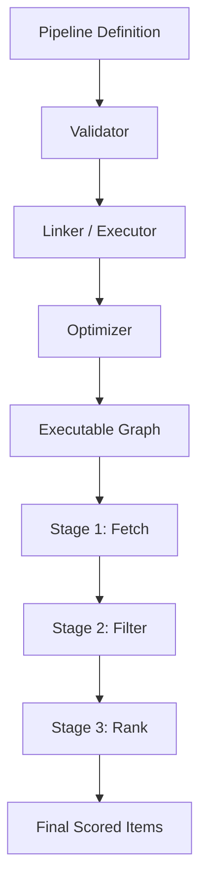

# 🏗️ Recommendation Pipeline Module

> **High-Performance, pluggable execution engine for complex ranking and filtering.**

The Pipeline module is the core execution engine of BONGAS-AI. It enables the definition of complex, multi-stage recommendation workflows using a pluggable architecture. It supports dynamic branching, parallel execution, and automated optimization.

---

## 🏗️ Architecture Overview



---

## 🧩 Sub-Modules

| Module | Description |
| :--- | :--- |
| [**⚡ Executor**](./executor/README.md) | High-performance graph traversal and stage execution. |
| [**🌲 Optimizer**](./optimizer/README.md) | JIT-lite fusion and parallelization optimizations. |
| [**🛡️ Validator**](./validator/README.md) | Structural integrity and type-safety gatekeeper. |
| [**🗃️ Registry**](./registry/README.md) | Central manifest of all available pipeline stages. |
| [**🧬 Context**](./context/README.md) | Thread-safe state container for pipeline execution. |
| [**📦 Types**](./types/README.md) | Core traits, domain models, and error definitions. |
| [**🎭 Stages**](./stages/README.md) | Library of concrete stage implementations. |

---

## 🚀 Quick Start

```rust
let executor = PipelineExecutor::new(config, cb_registry, observer, analytics);

// Execute a dynamically defined pipeline
let results = executor.execute(&definition, &context).await?;
```

---
[🏠 Back to Project Root](../../README.md)
