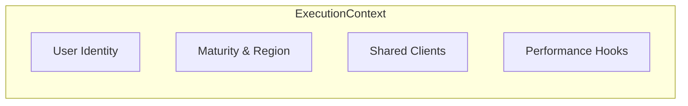

# 🧬 Pipeline: Execution Context

A thread-safe state container that follows a request through the entire pipeline. It provides access to shared resources (Redis, ClickHouse, ONNX Runtime) and records granular stage-level performance metrics.

---

## 🏗️ Context Anatomy

---

[🏠 Hub](../../../docs/HUB.md) | [⬅️ Back to Pipeline Main](../README.md)
