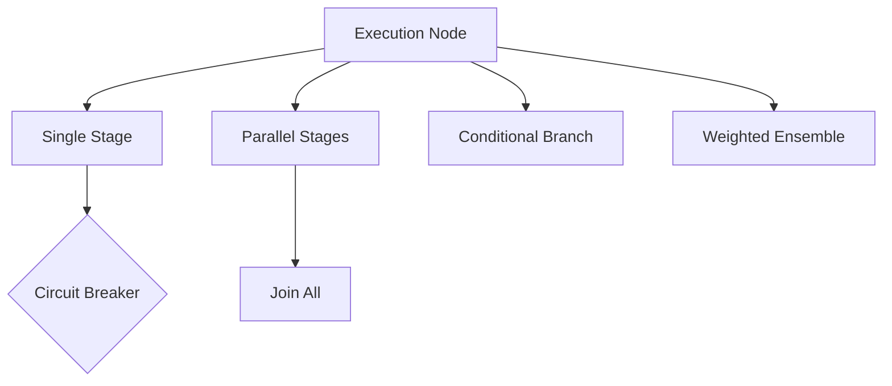

# ⚡ Pipeline: Executor

The heart of the execution engine. It is responsible for traversing the execution graph, managing per-stage timeouts, and providing circuit breaker protection for every individual component in the pipeline.

---

## 🏗️ Execution Model

---

## 🔑 Key Features

- **Automatic Parallelization**: Detects and executes independent stages concurrently.
- **Resilience First**: Integrates seamlessly with the Circuit Breaker module at the stage level.
- **Recursive Branching**: Supports complex nested logic via the `ExecutionNode` FSM.

---

[🏠 Hub](../../../docs/HUB.md) | [⬅️ Back to Pipeline Main](../README.md)
