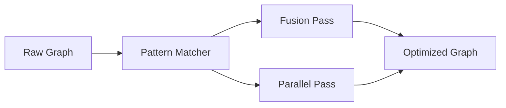

# 🌲 Pipeline: Optimizer

Analyzes executable graphs to identify performance bottlenecks and apply structural optimizations. Includes "JIT-lite" stage fusion to reduce memory allocations during high-frequency scoring passes.

---

## 🏗️ Optimization Flow

---

## 🔑 Key Features

- **Stage Fusion**: Merges sequential mathematical boosters into a single iteration pass.
- **Dependency Analysis**: Identifies stages that can be safely grouped into `ExecutionNode::Parallel`.
- **Zero-Cost Abstractions**: Minimizes overhead between dynamic definitions and static execution.

---
[⬅️ Back to Pipeline Main](../README.md)
