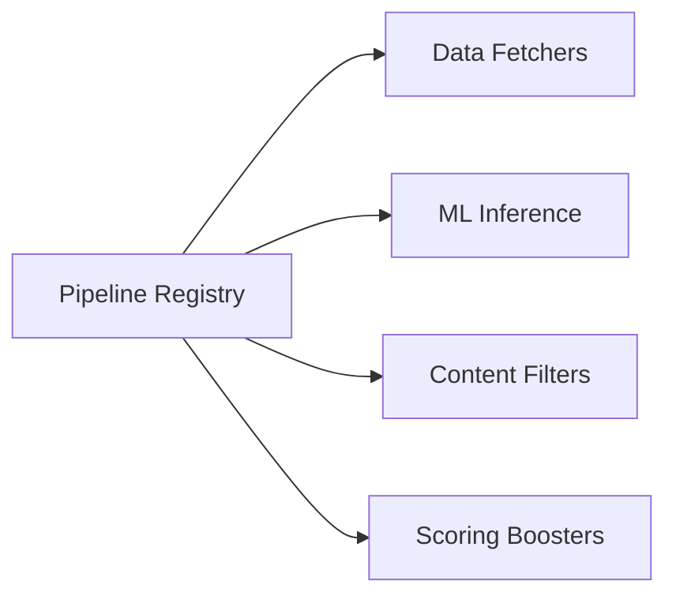

# 🗃️ Pipeline: Registry

The central manifest of every available stage in the BONGAS-AI ecosystem. It maps unique string identifiers (used in JSON definitions) to their concrete Rust implementations.

---

## 🏗️ Registry Model

---

## 🔑 Key Features

- **Alias Support**: Allows multiple names to point to the same implementation for backward compatibility.
- **Dynamic Extensibility**: Central location for plugging in new custom recommendation logic.
- **Strict Mapping**: Ensures a 1:1 relationship between type strings and stage traits.

---

[🏠 Hub](../../../docs/HUB.md) | [⬅️ Back to Pipeline Main](../README.md)
