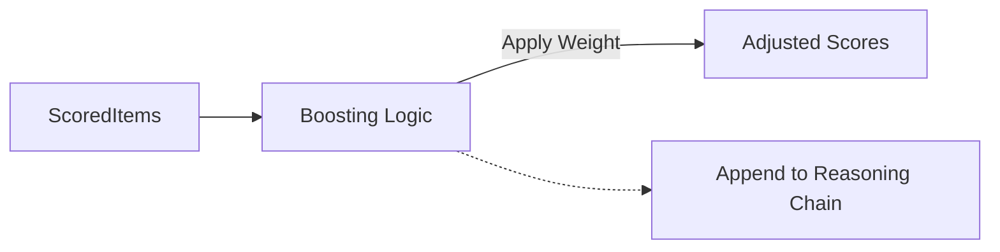

# 🚀 Pipeline Stages: Boost

> **Dynamic scoring adjustments to align results with user interests and business goals.**

Boosting stages modify the `score` of items in the pipeline without removing them. They are typically used for personalization, promoting new content, or applying seasonal trends.

---

## 🧩 Sub-Modules

| Stage | Description |
| :--- | :--- |
| **Affinity Freshness** | Intelligent boost for new content matching user affinities. |
| **Popularity** | Boosts items based on global or regional trending scores. |
| **Recency** | Linear or exponential decay boost for the newest items. |
| **Engagement** | Adjusts scores based on CTR and conversion history. |
| **Personalization** | User-item affinity matching at the scoring level. |

---

## 🏗️ Logic Flow

---
[⬅️ Back to Stages Main](../README.md)
