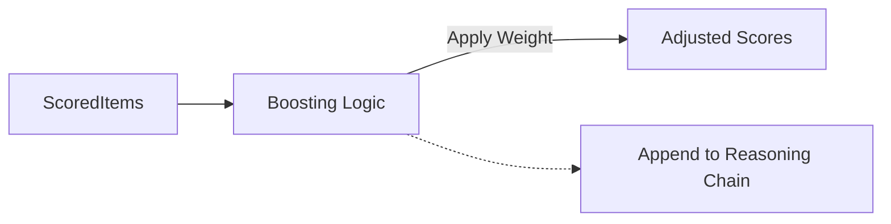

# 🚀 Pipeline Stages: Boost

> **Dynamic scoring adjustments to align results with user interests and business goals.**

Boosting stages modify the `score` of items in the pipeline without removing them. They are typically used for personalization, promoting new content, or applying seasonal trends.

---

## 🧩 Sub-Modules

| Stage | Description |
| :--- | :--- |
| [**⚡ Affinity Freshness**](./affinity_freshness/README.md) | Intelligent boost for new content matching user affinities. |
| [**📈 Popularity**](./boost_by_popularity/README.md) | Boosts items based on global or regional trending scores. |
| [**⏳ Recency**](./boost_by_recency/README.md) | Linear or exponential decay boost for the newest items. |
| [**🎯 Engagement**](./boost_engagement/README.md) | Adjusts scores based on CTR and conversion history. |
| [**👤 Personalization**](./boost_personalization/README.md) | User-item affinity matching at the scoring level. |
| [**💎 Completion Rate**](./boost_completion_rate/README.md) | Boosts content that users tend to finish. |
| [**🆕 New Content**](./boost_new_content/README.md) | Cold-start boost for items with low impression counts. |
| [**📢 Promoted**](./boost_promoted/README.md) | Business-driven boosting for sponsored or featured content. |
| [**🗓️ Seasonal**](./boost_seasonal/README.md) | Time-of-year or holiday-specific score adjustments. |
| [**🔥 Trending**](./boost_trending/README.md) | High-velocity momentum boosting for viral content. |
| [**🤝 User Affinity**](./boost_user_affinity/README.md) | Deep matching between user history and item properties. |

---

## 🏗️ Logic Flow

---
[⬅️ Back to Stages Main](../README.md)
