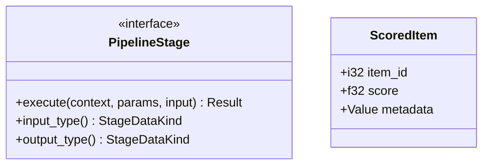

# 📦 Pipeline: Types

The core type system for the recommendation engine. Defines the fundamental traits and data structures that enable pluggable and composable pipelines.

---

## 🏗️ Core Interfaces

---

[🏠 Hub](../../../docs/HUB.md) | [⬅️ Back to Pipeline Main](../README.md)
