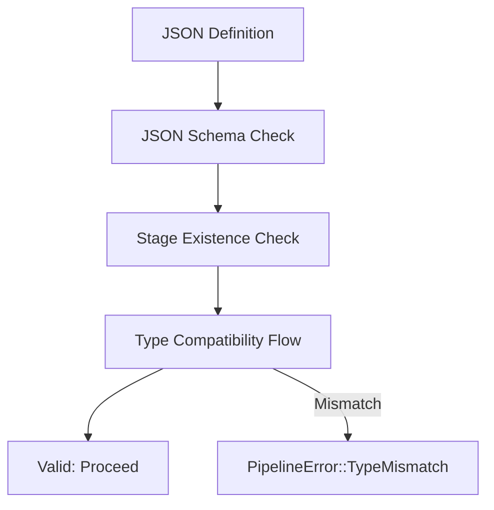

# 🛡️ Pipeline: Validator

The "Safety Gate" for the recommendation engine. It performs deep structural analysis of incoming JSON definitions to ensure they are logically sound and type-safe before activation.

---

## 🏗️ Validation Logic

---

## 🔑 Key Features

- **Recursive Type Checking**: Validates all possible execution branches (if/else).
- **Existence Verification**: Ensures all requested stages are registered in the global manifest.
- **Fail-Fast**: Prevents invalid pipelines from ever entering the active engine memory.

---

[🏠 Hub](../../../docs/HUB.md) | [⬅️ Back to Pipeline Main](../README.md)
